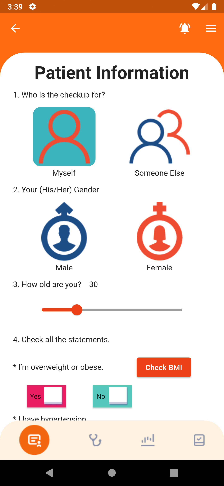
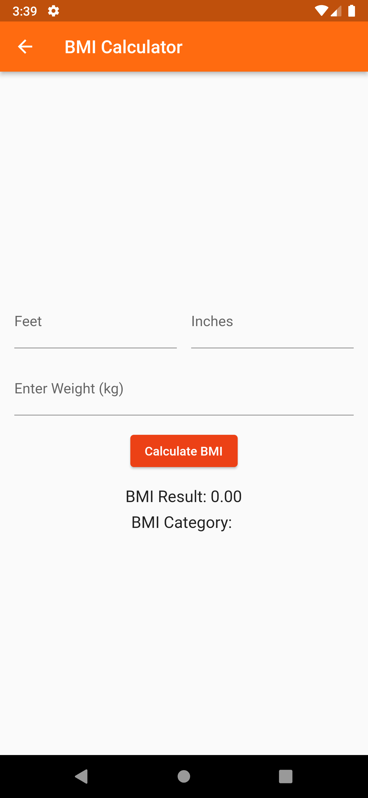
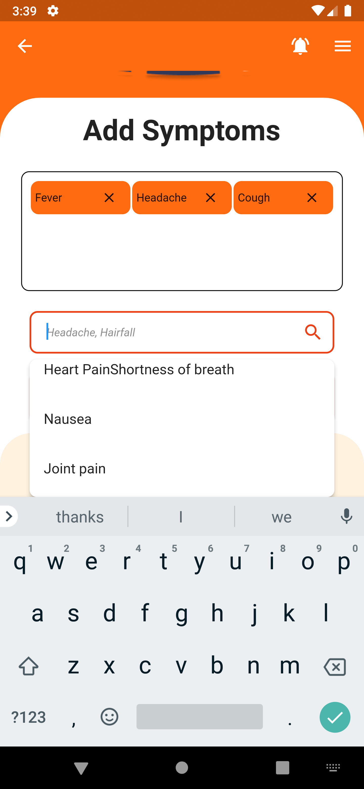
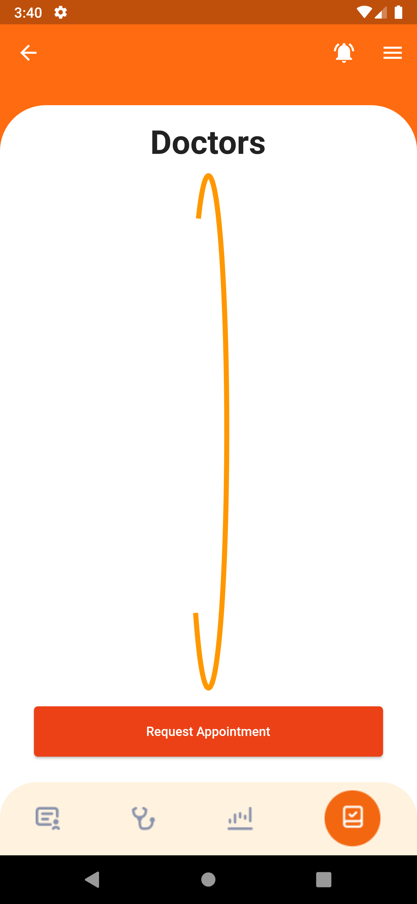

# SymptoDoc

SymptoDoc is a mobile app designed to empower users to assess potential health issues based on their symptoms. With an intuitive user interface and robust backend support, SymptoDoc is your reliable health companion.

## Features

- **User Profile:** Begin by providing basic information such as gender, age, smoking habits, and overweight status through an easy-to-use interface.

- **Symptom Input:** Log your symptoms effortlessly into the app, allowing SymptoDoc to analyze and detect potential diseases.

- **In-App Calculator:** Determine your overweight status with the built-in calculator, providing quick and accurate results.

- **Downloadable Reports:** Generate detailed health reports within the app, ready for download and sharing.

- **Social Media Integration:** Share your health reports seamlessly on popular social media platforms like WhatsApp, Instagram, and Facebook.

- **Doctor's Appointment:** Take the next step by scheduling a doctor's appointment directly from the app. Choose your preferred time and date for a hassle-free experience.

## Technologies Used

- **Firebase Auth and Firestore:** Secure user authentication and real-time database for seamless data management.

- **Flutter:** A powerful UI toolkit for creating natively compiled applications for mobile, web, and desktop from a single codebase.

- **GetX:** A lightweight and powerful state management library for Flutter.

- **Flutter Packages:**
  - `flutter_native_splash`
  - `shared_preferences`
  - `flutter_zoom_drawer`
  - `table_calendar`
  - `flutter_screenutil`
  - `screenshot`
  - `permission_handler`
  - `image_gallery_saver`
  - `flutter_typeahead`
  - `image_picker`
  - `share_plus`
  - `intl`
  - `path_provider`
  - `firebase_storage`

## Installation

To get started with SymptoDoc, follow the steps below:

1. Clone the repository:

```bash
git clone https://github.com/your-username/SymptoDoc.git
```
2. Install dependencies: flutter pub get
  
3. Run the application: flutter run

## Screenshots
<table>
  <tr>
    <td align="center"></td>
    <td align="center"></td>
    <td align="center"></td>
    <td align="center"></td>
  </tr>
  <tr>
    <td align="center"></td>
    <td align="center"></td>
    <td align="center"></td>
    <td align="center"></td>
  </tr>
  <tr>
    <td align="center"></td>
    <td align="center"></td>
    <td align="center"></td>
    <td align="center"></td>
  </tr>
  <tr>
    <td align="center"></td>
    <td align="center"></td>
    <td align="center"></td>
    <td align="center"></td>
  </tr>
  <tr>
    <td align="center"></td>
    <td align="center"></td>
    <td align="center"></td>
    <td align="center"></td>
  </tr>
  <tr>
    <td align="center"></td>
    <td align="center"></td>
  </tr>
</table>

## Contributing
If you want to contribute to this project, follow these steps:

Fork the repository.
Create a new branch for your feature: git checkout -b feature-name
Commit your changes: git commit -m 'Add some feature'
Create a new branch for your feature: git checkout -b feature-name
Commit your changes: git commit -m 'Add some feature'
